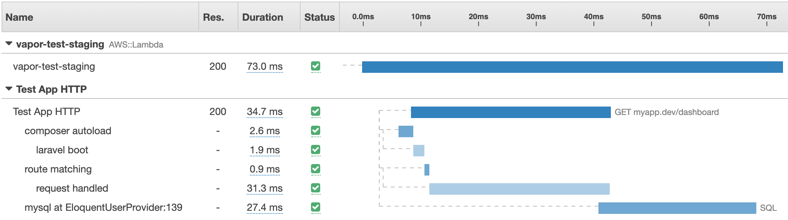
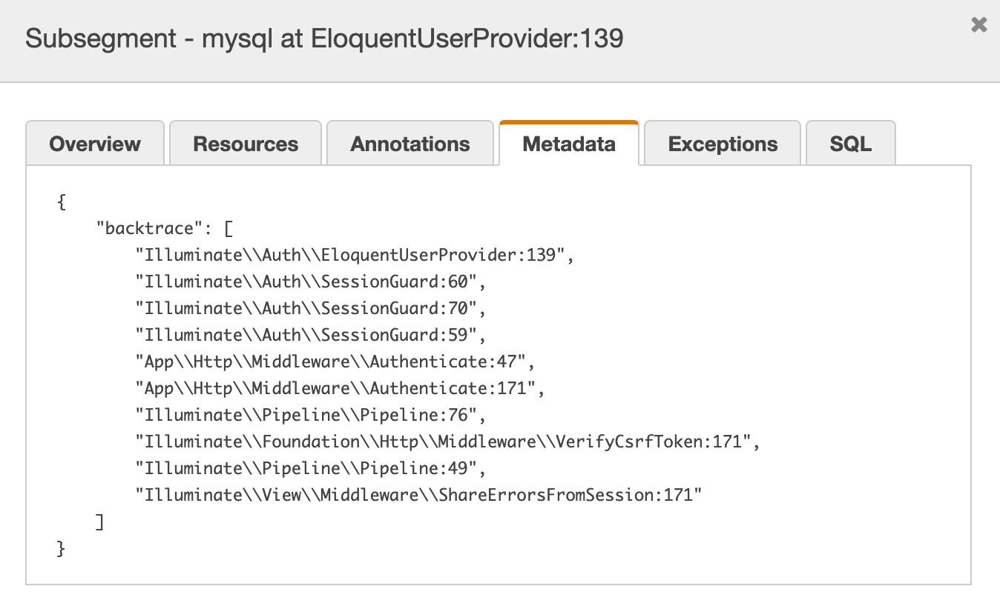
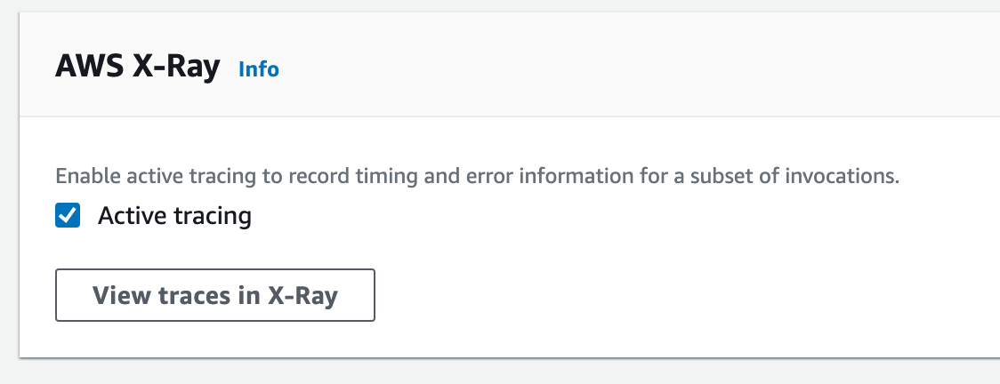
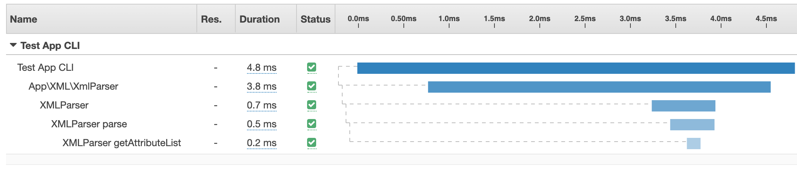

# Aws X-Ray for Laravel

[](https://github.com/104corp/xray-laravel/releases/latest)


The package automatically trace your laravel application and sends to [AWS X-Ray](https://aws.amazon.com/xray).

Support version matrix:

-   PHP 8.0, Laravel 6,7,8,9
-   PHP 8.1, Laravel 8,9 (Laravel 6,7 will break the functions)
-   PHP 8.2, Laravel 8,9
-   else are untested!

## What is X-Ray?

X-Ray is a distributed tracing system for production apps. AWS X-Ray traces user requests as they travel through your entire application.
It aggregates the data generated by the individual services and resources that make up your application, providing you an end-to-end view of how your application is performing.

## X-Ray for Laravel

This package enables automatic tracing of important parts of your application, such as http request, database queries, views and queue jobs. Those parts are being traced and sent to AWS X-Ray for you to improve performance.

Below is a simple example of a http request with a database query. This query is quite slow and could maybe be optimized or cached.



Each element has extra information, such as the database query stack trace.



## Installation

1. Install the package via composer:

```bash
composer require napp/xray-laravel
```

Update `composer.json` repositories value:

```json
{
  "repositories": [
    {
      "type": "vcs",
      "url": "https://github.com/104corp/xray-laravel"
    }
  ]
}
```

2. Add middleware to the top of the global middleware in `App\Http\Kernel.php`.

```php
protected $middleware = [
    \Napp\Xray\Middleware\RequestTracing::class, // here, help to close segment

    \App\Http\Middleware\TrustProxies::class,
    \App\Http\Middleware\CheckForMaintenanceMode::class,
    // ...
];
```

3. Add XrayServiceProvider to the very top of providers in `config/app.php`.

```php
'providers' => [
    /*
     * Laravel Framework Service Providers...
     */
    Napp\Xray\XrayServiceProvider::class, // here, help to open segment

    Illuminate\Auth\AuthServiceProvider::class,
    Illuminate\Broadcasting\BroadcastServiceProvider::class,
    // ...
];
```

Optionally, you can add the facade in `config/app.php`.

```php
'aliases' => [
    // ...
    'Xray' => \Napp\Xray\Facades\Xray::class,
],
```

4. Edit the AWS Execution role to include X-Ray permissions.

Either add the preexisting policy from AWS `AWSXrayWriteOnlyAccess`, or create your own:

```json
{
  "Version": "2012-10-17",
  "Statement": [
    {
      "Effect": "Allow",
      "Action": [
        "xray:PutTraceSegments",
        "xray:PutTelemetryRecords",
        "xray:GetSamplingRules",
        "xray:GetSamplingTargets",
        "xray:GetSamplingStatisticSummaries"
      ],
      "Resource": ["*"]
    }
  ]
}
```

5. Head over to AWS Console, to Lambda and find your function. Activate X-Ray Tracing.



## Manually use the Tracer

Lets say you want to trace a specific piece of your code to deeply understand the impact on performance.

```php
use Pkerrigan\Xray\Segment;

$segment = (new Segment())->setName('MyCustomLogic');
Xray::addSegment($segment);

// run your code

Xray::endSegment($segment->getId());
```

Another use case is to inspect some heavy php side parsing of data.

```php
use Napp\Xray\Facades\Xray;
use Pkerrigan\Xray\Segment;

class XMLParser
{
    public function handle($file)
    {
        // adding some metadata to the segment
        $segment = (new Segment())
          ->setName('XMLParser')
          ->addMetadata('file', $file->name());
        Xray::addSegment($segment);
        $this->parse($file);
        Xray::endSegment($segment->getId());
    }

    private function parse($xml): array
    {
        $segment = (new Segment())->setName('XMLParser parse');
        Xray::addSegment($segment);
        $output = $this->getAttributeList();
        // some more code
        Xray::endSegment($segment->getId());

        return $output;
    }

    private function getAttributeList(): array
    {
        $segment = (new Segment())->setName('XMLParser getAttributeList');
        Xray::addSegment($segment);
        // your code
        Xray::endSegment($segment->getId());

        return [];
    }
}
```

The above results in:



## Daemon support

The X-Ray daemon is automatically run in a Lambda environment. Use this over the default `Napp\Xray\Submission\APISegmentSubmitter` to relay requests to Amazon X-Ray.

Firstly, set up env `AWS_XRAY_DAEMON_HOST` and `AWS_XRAY_DAEMON_PORT` to switch submitter to `\Napp\Xray\Submission\DaemonSegmentSubmitter`

See more about [environment](#environment).

## Disable Tracer

If you want to disable the Tracer, just add to the `.env` file.

```dotenv
AWS_XRAY_ENABLED=false
```

## What Tracers are supported

-   [x] Composer autoload
-   [x] Framework boot
-   [x] Route matching
-   [x] Database queries
-   [x] Queue jobs
-   [x] Blade view render

## Environment

These environment variables are injected for you if using a service like [Laravel Vapor](https://vapor.laravel.com/)

-   `AWS_XRAY_ENABLED`, default: `true`
-   `AWS_XRAY_ENABLE_DB_QUERY`, default: `true`
-   `AWS_XRAY_ENABLE_DB_QUERY_BINDINGS`, default: `false`
-   `AWS_XRAY_ENABLE_JOB`, default: `true`
-   `AWS_XRAY_ENABLE_VIEW`, default: `true`
-   `AWS_XRAY_ENABLE_ROUTE`, default: `true`
-   `AWS_XRAY_ENABLE_FRAMEWORK`, default: `true`
-   `AWS_XRAY_SAMPLE_RATE`, default: `100`
    -   should between `1` to `100`
    -   when not finding `HTTP_X_AMZN_TRACE_ID` in header, using this sample rate globally

### Daemon

-   `AWS_XRAY_DAEMON_HOST`
-   `AWS_XRAY_DAEMON_PORT`, default: `2000`

### API

-   `AWS_XRAY_REGION`, default: `AWS_DEFAULT_REGION`
-   `AWS_XRAY_VERSION`, default: `latest`
-   `AWS_XRAY_SIGNATURE_VERSION`, default: `v4`
-   `AWS_XRAY_ACCESS_KEY_ID`, default: `AWS_ACCESS_KEY_ID`
-   `AWS_XRAY_SECRET_ACCESS_KEY`, default: `AWS_SECRET_ACCESS_KEY`
-   `AWS_XRAY_TOKEN`

## LICENSE

The MIT License (MIT). Please see [License File](LICENSE.md) for more information.
